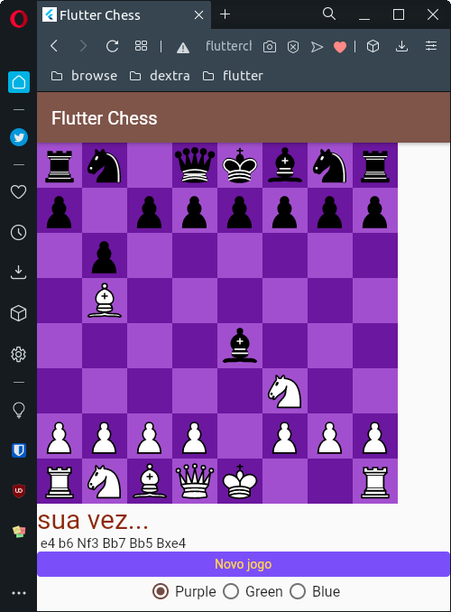

# flutter-chess

A flutter chess app with simple AI

Uses [flutter stateless chesboard](https://github.com/varunpvp/flutter_chessboard) as the UI and the [minimax algorithm](https://javascript.plainenglish.io/build-a-simple-chess-ai-in-javascript-22b350abb31) described in javascript in this article.

